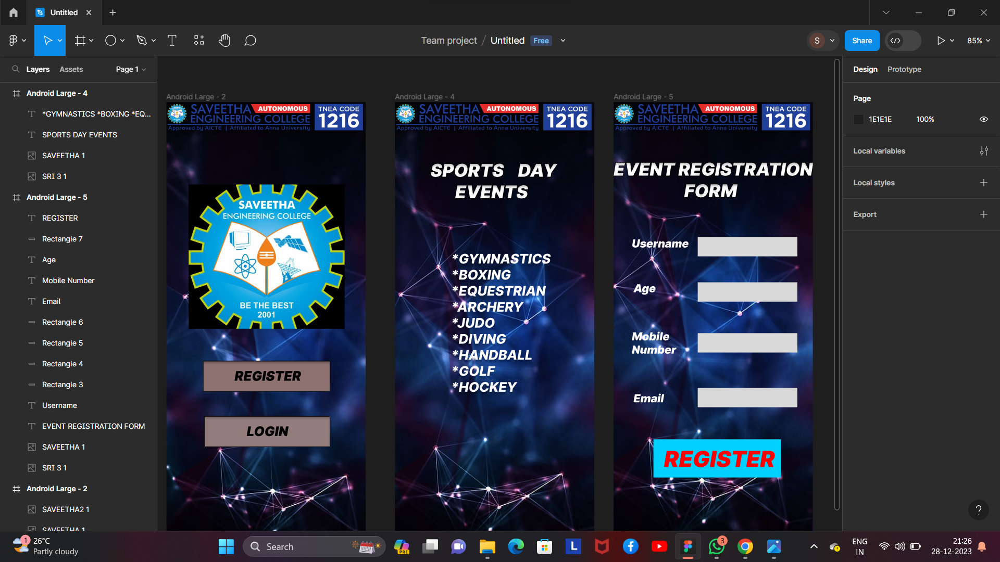

# Ex09 Event Registration Web Application
## Date:

## AIM:
To design, develop and deploy a web application for event registration.

## DESIGN STEPS:

### Step 1:
Create a new frame.

### Step 2:
Select any one preset size of your choice.

### Step 3:
Select the shapes you need.

### Step 4:
Import images as needed.

### Step 5:
Create pages based on your need and link them.

### Step 6:

Validate the HTML and CSS code.

### Step 6:

Publish the website in the given URL.

## DESIGN TOOL:
Figma

## CODE:
``` 
home page
<div style="width: 100%; height: 100%; position: relative; background: #B30DF5">
    
    <div style="width: 230px; height: 56px; left: 66px; top: 468px; position: absolute; background: #8E7272; box-shadow: 0px 4px 4px rgba(0, 0, 0, 0.25) inset; border: 1px #0D0C0C solid"></div>
    <div style="left: 123px; top: 481px; position: absolute; mix-blend-mode: hard-light; color: black; font-size: 24px; font-family: Inter; font-style: italic; font-weight: 900; word-wrap: break-word">REGISTER</div>
    <div style="width: 228px; height: 56px; left: 68px; top: 568px; position: absolute; background: #927C7C; box-shadow: 0px 4px 4px rgba(0, 0, 0, 0.25) inset; border: 1px black solid"></div>
    <div style="left: 145px; top: 581px; position: absolute; mix-blend-mode: hard-light; color: black; font-size: 24px; font-family: Inter; font-style: italic; font-weight: 900; word-wrap: break-word">LOGIN</div>
    
    
</div>

// REGISTER
color: black;
 font-size: 24px;
 font-family: Inter;
 font-style: italic;
 font-weight: 900;
 word-wrap: break-word
---
// LOGIN
color: black;
 font-size: 24px;
 font-family: Inter;
 font-style: italic;
 font-weight: 900;
 word-wrap: break-word

page 2

<div style="width: 100%; height: 100%; position: relative; background: #B30DF5">
    
    
    <div style="left: 64px; top: 104px; position: absolute; color: white; font-size: 32px; font-family: Inter; font-style: italic; font-weight: 900; word-wrap: break-word">SPORTS    DAY<br/>       EVENTS</div>
    <div style="width: 234px; height: 399px; left: 101px; top: 269px; position: absolute; mix-blend-mode: hard-light; color: white; font-size: 24px; font-family: Inter; font-style: italic; font-weight: 800; word-wrap: break-word">*GYMNASTICS<br/>*BOXING<br/>*EQUESTRIAN<br/>*ARCHERY<br/>*JUDO<br/>*DIVING<br/>*HANDBALL<br/>*GOLF<br/>*HOCKEY</div>
</div>

// SPORTS    DAY<br/>       EVENTS
color: white;
 font-size: 32px;
 font-family: Inter;
 font-style: italic;
 font-weight: 900;
 word-wrap: break-word
---
// *GYMNASTICS<br/>*BOXING<br/>*EQUESTRIAN<br/>*ARCHERY<br/>*JUDO<br/>*DIVING<br/>*HANDBALL<br/>*GOLF<br/>*HOCKEY
color: white;
 font-size: 24px;
 font-family: Inter;
 font-style: italic;
 font-weight: 800;
 word-wrap: break-word

 page 3

 <div style="width: 100%; height: 100%; position: relative; background: #B30DF5">
    
    
    <div style="width: 361px; height: 76px; left: 0px; top: 102px; position: absolute; color: white; font-size: 32px; font-family: Inter; font-style: italic; font-weight: 900; word-wrap: break-word">EVENT REGISTRATION <br/>                    FORM</div>
    <div style="left: 33px; top: 244px; position: absolute; mix-blend-mode: hard-light; color: white; font-size: 20px; font-family: Inter; font-style: italic; font-weight: 900; word-wrap: break-word">Username</div>
    <div style="width: 180px; height: 35px; left: 152px; top: 244px; position: absolute; background: #D9D9D9"></div>
    <div style="width: 180px; height: 35px; left: 152px; top: 326px; position: absolute; background: #D9D9D9"></div>
    <div style="width: 180px; height: 35px; left: 152px; top: 418px; position: absolute; background: #D9D9D9"></div>
    <div style="width: 180px; height: 35px; left: 152px; top: 517px; position: absolute; background: #D9D9D9"></div>
    <div style="left: 36px; top: 524px; position: absolute; mix-blend-mode: hard-light; color: white; font-size: 20px; font-family: Inter; font-style: italic; font-weight: 900; word-wrap: break-word">Email</div>
    <div style="left: 33px; top: 412px; position: absolute; mix-blend-mode: hard-light; color: white; font-size: 20px; font-family: Inter; font-style: italic; font-weight: 900; word-wrap: break-word">Mobile<br/>Number</div>
    <div style="left: 36px; top: 325px; position: absolute; mix-blend-mode: hard-light; color: white; font-size: 20px; font-family: Inter; font-style: italic; font-weight: 900; word-wrap: break-word">Age</div>
    <div style="width: 230px; height: 69px; left: 72px; top: 610px; position: absolute; background: #00D1FF"></div>
    <div style="left: 91px; top: 621px; position: absolute; color: #FF0000; font-size: 40px; font-family: Inter; font-style: italic; font-weight: 900; word-wrap: break-word">REGISTER</div>
</div>

// EVENT REGISTRATION <br/>                    FORM
color: white;
 font-size: 32px;
 font-family: Inter;
 font-style: italic;
 font-weight: 900;
 word-wrap: break-word
---
// Username
color: white;
 font-size: 20px;
 font-family: Inter;
 font-style: italic;
 font-weight: 900;
 word-wrap: break-word
---
// Email
color: white;
 font-size: 20px;
 font-family: Inter;
 font-style: italic;
 font-weight: 900;
 word-wrap: break-word
---
// Mobile<br/>Number
color: white;
 font-size: 20px;
 font-family: Inter;
 font-style: italic;
 font-weight: 900;
 word-wrap: break-word
---
// Age
color: white;
 font-size: 20px;
 font-family: Inter;
 font-style: italic;
 font-weight: 900;
 word-wrap: break-word
---
// REGISTER
color: #FF0000;
 font-size: 40px;
 font-family: Inter;
 font-style: italic;
 font-weight: 900;
 word-wrap: break-word
```
## OUTPUT:


## RESULT:
The program to design, develop and deploy a web application for event registration is completed successfully.
